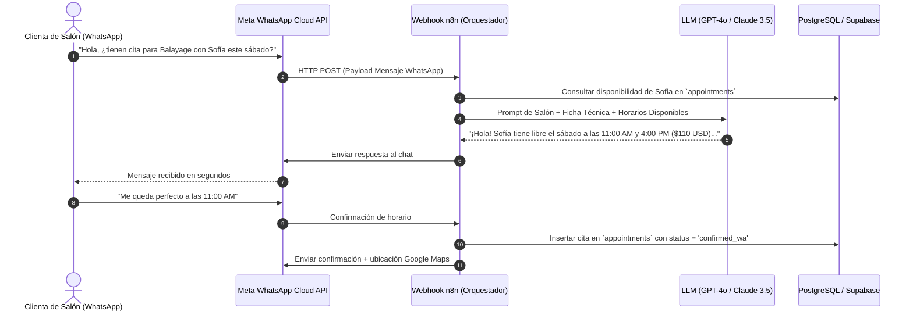

# Arquitectura de Automatizaciones & Agente WhatsApp IA (n8n + OpenAI / Claude)

Este documento detalla la integración del **Agente de WhatsApp IA**, el motor de **Recordatorios Anti-Plantones** y la sincronización con el CRM de **BeautyFlow AI**.

---

## 🔄 1. Diagrama de Flujo del Agente de WhatsApp



---

## ⏰ 2. Motor de Recordatorios Anti-Plantones (Cron Jobs)

Para reducir las inasistencias en más de un 80%, el sistema ejecuta dos tareas programadas en segundo plano:

### A. Recordatorio 24 Horas Antes (Día Anterior a las 10:00 AM)
- **Filtro SQL:** `start_time BETWEEN NOW() + INTERVAL '23 hours' AND NOW() + INTERVAL '25 hours'` y `reminder_24h_sent = FALSE`.
- **Acción:** Envía mensaje con botones interactivos de WhatsApp: `[1] Confirmar Asistencia`, `[2] Reprogramar`.
- **Efecto:** Si la clienta cancela, el turno se libera de inmediato en la agenda web para que otra persona lo tome.

### B. Recordatorio 2 Horas Antes (Mismo Día)
- **Filtro SQL:** `start_time BETWEEN NOW() + INTERVAL '1 hour 50 min' AND NOW() + INTERVAL '2 hours 10 min'` y `reminder_2h_sent = FALSE`.
- **Acción:** Envía recordatorio de salida con botón de navegación directa hacia Google Maps / Waze.

---

## 🎯 3. Campaña de Re-Atracción Automática (Ciclo Capilar 35 Días)

- **Filtro SQL:**
  ```sql
  SELECT c.phone, c.full_name, cr.formula_details, MAX(a.start_time) as ultima_cita
  FROM public.clients c
  JOIN public.appointments a ON a.client_id = c.id
  JOIN public.color_records cr ON cr.client_id = c.id
  GROUP BY c.id, cr.formula_details
  HAVING MAX(a.start_time) < NOW() - INTERVAL '35 days';
  ```
- **Disparador:** Mensaje de WhatsApp personalizado sugiriendo el matizado o retoque de raíz con un 15% de descuento especial.
